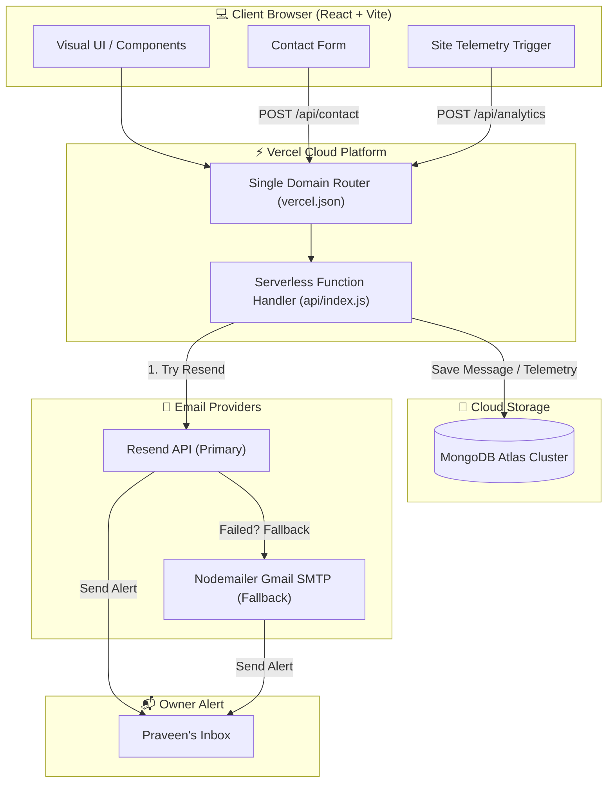

<div align="center">

  <!-- Header Badges -->
  
  
  
  
  

  <br /><br />

  <h1>✨ Praveen Kumar K (Developer & UI/UX Designer) ✨</h1>

  <p>
    <b>A high-performance, modern personal portfolio and interactive web application.</b><br />
    Designed with glassmorphism aesthetics, dynamic micro-animations, cloud database persistence, and automated email notifications.
  </p>

  <p>
    <a href="https://praveen-kumar-portfolio-developer.vercel.app/" target="_blank">
      
    </a>
  </p>

</div>


## 📌 About

A modern personal portfolio showcasing my projects, technical skills, UI/UX work, resume, certifications, and contact information.


---

## 📖 Table of Contents

- [✨ Overview](#-overview)
- [🏗 System Architecture](#-system-architecture)
- [🛠 Deep Tech Stack Elaboration](#-deep-tech-stack-elaboration)
- [🚀 Core Features & Innovations](#-core-features--innovations)
- [⚙️ Local Installation & Development](#-local-installation--development)
- [☁️ Environment Variables & Vercel Deployment](#️-environment-variables--vercel-deployment)
- [📄 License & Contact](#-license--contact)

---

## ✨ Overview

This repository powers **Praveen Kumar K's** official portfolio. Designed as a modern UI/UX showcase, this application incorporates a serverless cloud infrastructure capable of:

- 📬 **Receiving & Persisting Messages**: Contact form capture stored securely in MongoDB Atlas with client device details.
- ⚡ **Dual Email Delivery Engine**: Guaranteed notification delivery utilizing **Resend API** as the primary handler and **Nodemailer (Gmail SMTP)** as an automatic fallback.
- 📊 **Site Analytics & Metrics**: Tracking total site visits, resume downloads, certificate views, and project interactions.

---

## 🏗 System Architecture

The application uses a **unified single-domain architecture** on Vercel. Vite handles client-side UI rendering while serverless API routes handle data storage and email delivery under `/api/*`.



---

## 🛠 Deep Tech Stack Elaboration

### 🎨 1. Frontend Layer
- **React 19 & Vite 8**: Built on the latest React architecture and Vite build tool for instant HMR and optimized production bundles.
- **Tailwind CSS & PostCSS**: Custom utility-first styling featuring dark gradients, glassmorphism filters (`backdrop-blur`), grid patterns, and responsive layouts.
- **Framer Motion**: Smooth scroll-triggered component entrances, interactive card hover effects, modal popups, and tab transitions.
- **Lucide Icons & React Icons**: Modern vector icon libraries providing crisp visual icons across all sections.

### ⚡ 2. Backend & Serverless API
- **Node.js & Vercel Serverless**: Lightweight API routing wrapped inside Vercel Serverless Functions (`api/index.js`).
- **Unified Domain Rewrite (`vercel.json`)**: Eliminates CORS complications by proxying all `/api/*` network requests seamlessly through the main web domain.
- **Modular Route Structure**: Clean separation between database schemas (`api/models/`), email services (`api/services/mailer.js`), and database handlers (`api/services/database.js`).

### 🍃 3. Database & Cloud Persistence
- **MongoDB Atlas**: Cloud-hosted NoSQL database storing contact messages, visitor telemetry, resume downloads, and certificate interactions.
- **Mongoose ODM**: Strongly typed schema modeling with index optimization and automated timestamping (`createdAt`).

### 📧 4. Automated Email Delivery System
- **Resend API**: Fast transactional email API used as the primary notification provider.
- **Nodemailer (Gmail SMTP)**: Reliable secondary failover system utilizing Gmail App Passwords.
- **HTML Email Templates**: Custom dark-themed responsive HTML templates sent to both the portfolio owner (instant alert) and the visitor (confirmation auto-reply).

---

## 🚀 Core Features & Innovations

| Feature | Description |
| :--- | :--- |
| **🎨 Cyber-Dark Aesthetic** | Modern dark UI featuring neon glowing accents, glassmorphic cards, and custom typography. |
| **📁 Interactive Resume & Certs** | Downloadable PDF resume served via `public/resume.pdf` + interactive certificate preview modals. |
| **🛡 Rate-Limiting & Security** | Sanitized inputs to prevent XSS attacks and input abuse across all contact API endpoints. |
| **📊 Real-Time Telemetry** | Captures browser details, device type, referrer origin, and interaction timestamps. |

---

## ⚙️ Local Installation & Development

### 1. Clone & Install Dependencies
```bash
git clone https://github.com/Praveenofficial12/Praveen-Kumar-portfolio.git
cd Praveen-Kumar-portfolio
npm install
```

### 2. Configure Environment Variables
Create a `.env` file in the root directory:
```env
# MongoDB Atlas Database Connection
MONGODB_URI=mongodb+srv://<username>:<password>@<cluster>.mongodb.net/portfolio?retryWrites=true&w=majority

# Portfolio Owner Destination Email
OWNER_EMAIL=praveenkumark1204@gmail.com

# Primary Email Provider (Resend API)
RESEND_API_KEY=your_resend_api_key_here

# Fallback Email Provider (Nodemailer / SMTP)
SMTP_HOST=smtp.gmail.com
SMTP_PORT=587
SMTP_USER=praveenkumark1204@gmail.com
SMTP_PASS=your_gmail_app_password_here

# Local Development Port
PORT=3001
```

### 3. Run Dev Server
Launch the development environment:
```bash
npm run dev
```

- **Frontend**: [http://localhost:5173](http://localhost:5173)
- **Backend API**: [http://localhost:3001](http://localhost:3001)

### 4. Test Email System
Verify email delivery diagnostics via script:
```bash
node scripts/test-email.mjs
```

---

## ☁️ Environment Variables & Vercel Deployment

Deploying on Vercel takes less than two minutes:

1. Push your latest code to GitHub.
2. Import your repository into **Vercel**.
3. Go to **Project Settings → Environment Variables** and enter the following key-value pairs:

| Key Name | Purpose | Example Value |
| :--- | :--- | :--- |
| `MONGODB_URI` | MongoDB Atlas Connection String | `mongodb+srv://...` |
| `OWNER_EMAIL` | Target email for contact alerts | `praveenkumark1204@gmail.com` |
| `RESEND_API_KEY` | Resend API key | `re_...` |
| `SMTP_HOST` | Gmail SMTP Server | `smtp.gmail.com` |
| `SMTP_PORT` | SMTP Port | `587` |
| `SMTP_USER` | Gmail sender address | `praveenkumark1204@gmail.com` |
| `SMTP_PASS` | Gmail App Password | `16_character_app_pass` |

4. Click **Deploy**. Vercel will automatically build the React client and host the serverless endpoints!

---

## 📄 License & Contact

Developed with ❤️ by **Praveen Kumar K** (Developer & UI/UX Designer)

- **Email**: [praveenkumark1204@gmail.com](mailto:praveenkumark1204@gmail.com)
- **GitHub**: [@Praveenofficial12](https://github.com/Praveenofficial12)
- **LinkedIn**: [praveen-kumar-k-developer](https://linkedin.com/in/praveen-kumar-k-developer)
- **Live Portfolio**: [praveen-kumar-portfolio-developer.vercel.app](https://praveen-kumar-portfolio-developer.vercel.app/)

<div align="center">
  <sub>Designed & Engineered for High Performance and Professional Excellence</sub>
</div>
